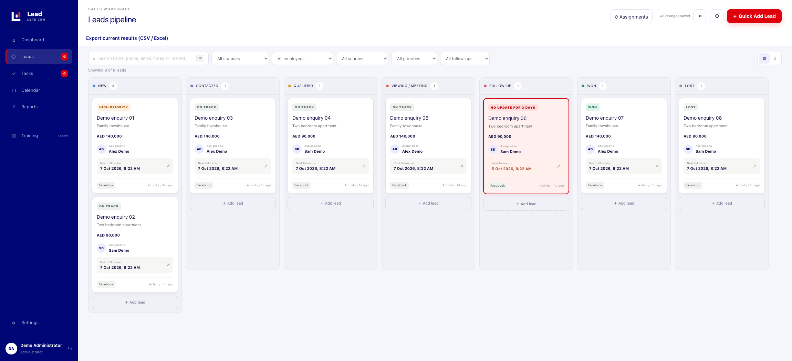
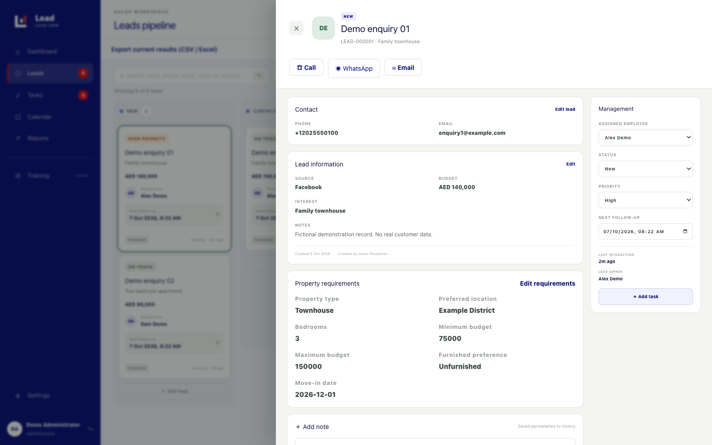
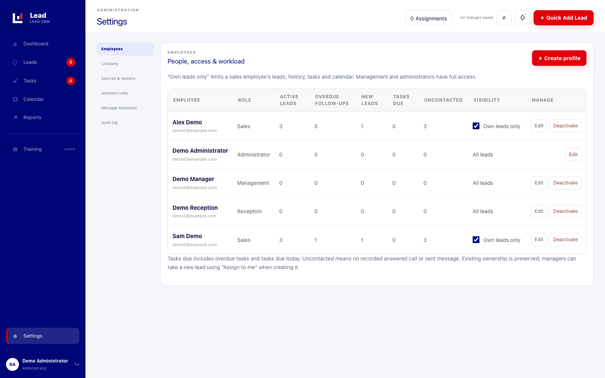

# Lead Management CRM

A self-hosted lead management application for small teams. Capture enquiries, assign ownership, record conversations and keep the next follow-up visible, without a separate database server or complex messaging automation.

This is a **sanitized software-only edition**. It contains no company database, employee accounts, passwords, customer records, internal training documents, company logo, deployment backups or production configuration. Screenshots use temporary fictional demo records; those records are not bundled or loaded at startup.

## Screenshots

### Lead pipeline



### Lead profile and property requirements



### Employee permissions and workload



## Features

- Seven pipeline stages: New, Contacted, Qualified, Viewing / Meeting, Follow-up, Won and Lost.
- Quick Add Lead with name, phone, source, interest and assigned employee.
- Lead profiles with notes, activity history, priorities, follow-ups and property requirements.
- Search and filters for status, employee, source, priority and follow-up attention.
- Management, Administrator, Reception and Sales roles, with server-enforced own-lead visibility for sales.
- Employee creation, editing, password reset, workload counts and deactivation with active-lead transfer.
- Durable assignment notifications, plus an optional Windows desktop notifier.
- Red cards after 72 hours without a recorded call, message, note or status update.
- Required lost reasons, call outcomes and editable WhatsApp templates with copy-to-message workflow.
- Basic tasks and appointments, first-response reports and filtered CSV exports that open in Excel.
- SQLite persistence, password hashing, cookie sessions, CSRF checks, audit history and a verified backup utility.

## Technology

React 19 and TypeScript, vinext/Vite, Express 5, Node.js 22 and built-in `node:sqlite`. The frontend runs behind an Express gateway. SQLite stays on the server; employees access the same application through their browsers.

## Getting started

Use **Node.js 22.13 or later in the 22.x series**, with npm. No PostgreSQL or SQL Server installation is needed. Internet access is needed to install dependencies. The interface uses system fonts rather than remote font requests.

```bash
git clone https://github.com/earlyad4/Lead-management-crm-system.git
cd Lead-management-crm-system
npm ci
```

Copy `.env.example` to `.env` (`cp .env.example .env` on macOS/Linux, or `Copy-Item .env.example .env` in PowerShell), then run:

```bash
npm run migrate
```

This creates a new, empty database at `database/LeadCRM.db`. There are **no default login credentials**. Create your own administrator before signing in.

### Create the first administrator in PowerShell

```powershell
$env:ADMIN_EMAIL = Read-Host 'Administrator email'
$env:ADMIN_NAME = Read-Host 'Administrator display name'
$CrmPassword = Read-Host 'Administrator password (at least 8 characters)' -AsSecureString
$CrmCredential = New-Object System.Management.Automation.PSCredential($env:ADMIN_EMAIL, $CrmPassword)
$env:ADMIN_PASSWORD = $CrmCredential.GetNetworkCredential().Password
try { npm run admin:create }
finally {
    Remove-Item Env:ADMIN_PASSWORD, Env:ADMIN_EMAIL, Env:ADMIN_NAME -ErrorAction SilentlyContinue
    $CrmCredential = $null
    $CrmPassword = $null
}
```

On macOS/Linux, supply `ADMIN_EMAIL`, `ADMIN_NAME` and `ADMIN_PASSWORD` in the process environment, then run `npm run admin:create`. Use a private prompt or your secret manager rather than saving passwords in shell history. Running this command for an existing email updates that account to Administrator, resets its password and invalidates its sessions.

### Start the application

```bash
npm run build
npm start
```

Open **http://localhost:3000**. For local development, use `npm run dev` instead. Stop with Ctrl+C. The application checks and applies pending migrations at startup.

## Using the CRM

| Action | Location |
| --- | --- |
| Create a lead | Top bar → Quick Add Lead |
| Add notes or schedule the next follow-up | Leads → open a card |
| Record property needs | Lead profile → Property requirements |
| Record a call outcome | Lead profile → Call |
| Copy a WhatsApp message | Lead profile → WhatsApp → template → Copy message |
| Create employees or change sales visibility | Settings → Employees |
| Edit shared messages | Settings → Message templates |
| Configure inactivity highlighting | Settings → Attention rules |
| Open assigned-lead alerts | Top bar → Assignments |
| Review workload | Settings → Employees |
| Review first response time | Reports → First response time |
| Export the current search and filters | Leads → Export current results |

Opening a call or message link does not prove contact. Record the call outcome or confirm that the message was sent. Only answered calls and confirmed sent WhatsApp/email messages qualify for the first-response report. A call-back outcome does not automatically schedule a follow-up; set that date separately.

The Training navigation item is retained as an empty extension point. No private manuals or sales scripts are included.

## Roles and assignment rules

| Role | Scope |
| --- | --- |
| Administrator | Full application administration, reports and exports; cannot receive new lead assignments. |
| Management | Full application permissions; can assign a newly created lead to themselves. |
| Reception | Company lead access; creates Sales, Reception and Management profiles; manages Sales profiles and visibility. |
| Sales | Own assigned leads by default; authorized staff can switch off “Own leads only” to allow wider visibility. |

Management and Administrator accounts do not appear in ordinary lead-assignment dropdowns. Wider lead visibility does not give Sales employee-administration or reporting permissions. Reception cannot create Administrator profiles or edit existing Management/Admin profiles.

## LAN deployment

Run one application instance with its database on local server storage. The default gateway listens on port 3000; the frontend listens on loopback port 3001. Configure the server firewall to allow port 3000 only from your trusted network, and use `http://YOUR-SERVER:3000` from employee browsers. A `localhost` URL on an employee computer points to that computer, not to the server.

This public edition does not configure Windows startup tasks or firewall rules automatically. Keep the server process running or arrange a service with your administrator. Do not put a live SQLite file on a shared network drive or synchronize it through a consumer cloud folder.

**Do not expose port 3000 directly to the internet.** Use HTTPS and an appropriately secured reverse proxy for any deployment beyond a trusted LAN. Set `COOKIE_SECURE=true` only when accessed over HTTPS; set `TRUST_PROXY=true` only behind a trusted proxy. Plain HTTP does not encrypt credentials or lead data.

### Optional Windows desktop alerts

On each employee's Windows PC, copy `desktop-notifier`, open PowerShell in that folder, and run:

```powershell
powershell -NoProfile -STA -ExecutionPolicy Bypass -File .\Start-Desktop-Alerts.ps1 -ServerUrl 'http://YOUR-SERVER:3000'
```

Sign in with the employee's own CRM account and leave the helper running. It polls for unread assignments and displays a persistent window. It stores no passwords and does not start automatically. The bundled launcher defaults to localhost for development; use the server address for actual employees. The helper requires Windows and has not been runtime-tested on Windows in this publication workflow.

In-app alerts remain stored even when the helper is closed. Browser desktop banners depend on a secure context, browser permissions and operating-system behavior; they are not guaranteed to remain visible until clicked.

## Database and backups

The ignored `database/` directory contains all runtime business data, including users, hashed passwords, sessions, leads, history and settings. Changing `DATABASE_FILE` selects a different database; it does not transfer existing records.

```bash
node --no-warnings scripts/sqlite-maintenance.mjs backup database/LeadCRM.db backups/crm-backup.db
node --no-warnings scripts/sqlite-maintenance.mjs verify backups/crm-backup.db
```

The backup utility uses SQLite's backup API and verifies integrity. Choose a new backup filename for each run and arrange an appropriate off-device retention policy. Backups are sensitive and must never be committed. Restore only with all application processes stopped and after preserving current files; ask your administrator to handle recovery if unsure.

This sanitized edition is for a **fresh installation**, not an in-place upgrade of a private deployment. Its default branding and migration contents differ from the private application. Do not point it at an existing company database.

## Development checks

```bash
npm run check
npm test
npm run build
```

The API/domain suite covers access isolation, assignments, accounts, CSRF, validation, persistence, concurrent writes and exports. Test accounts and records are fictional and created only in test fixtures, not in production. Dependency versions are pinned by `package-lock.json`; review dependency advisories and test upgrades before deployment. Passing the tests is not a security certification.

## Repository layout

```text
app/                 CRM interface and styles
server/              API, authentication, access rules and tests
migrations/          SQLite schema migrations and generic settings
scripts/             Process manager, admin creation and backup utility
desktop-notifier/    Optional Windows assignment popup client
public/brand/        Neutral software logo
docs/screenshots/    Fictional demonstration screenshots
```

## Publication scope

Only application source, dependency manifests, generic configuration, automated tests, this README and reviewed screenshots are published. Production data, credentials and password hashes, real staff details, business training content, private deployment scripts, logs and exports are excluded. The original private application is not modified by this distribution.
